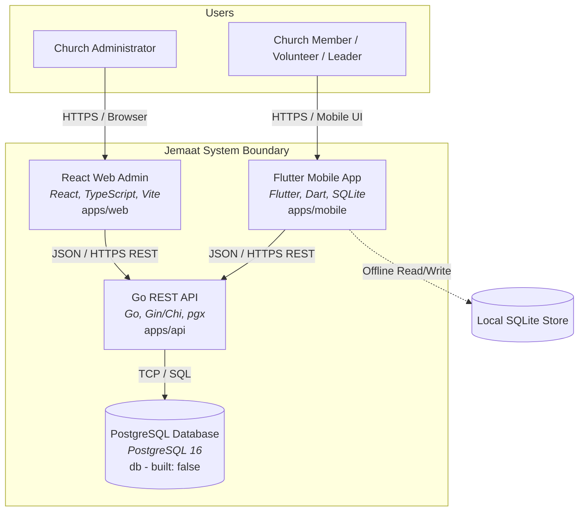

# blueprint

> Generated by `.constitution/method/scripts/validate.py --generate`. MUST NOT be hand-edited.


This is what the owner reads at **G3 Blueprint** — one page, every one of the gate's seven questions answerable from it. Its content is affected by neither `mode` nor `risk_accepted`.


## Use case catalogue

**19 use cases**, 2 marked `critical`. Rendered from `usecases.yaml`.

| id | Use case | Component | Satisfies | critical |
| --- | --- | --- | --- | --- |
| `UC-1` | I want to record a new church member with their personal and contact details. | `membership` | `FR-1` | yes |
| `UC-2` | I want to link family members together into a shared household. | `membership` | `FR-2` | no |
| `UC-3` | I want to import our church's member spreadsheet and review potential duplicates. | `membership` | `FR-3` | no |
| `UC-4` | I want to update a congregant's membership standing when they transfer or relocate. | `membership` | `FR-4` | no |
| `UC-5` | I want to review and update my own personal and household profile. | `membership` | `FR-1`, `FR-2` | no |
| `UC-6` | I want to configure our ministry teams and define their serving roles. | `serving` | `FR-5` | no |
| `UC-7` | I want to build the monthly service roster and assign qualified volunteers. | `serving` | `FR-6` | no |
| `UC-8` | I want to confirm, decline, or swap my scheduled serving assignment with one tap. | `serving` | `FR-7` | no |
| `UC-9` | I want to block out the dates when I will be traveling or unavailable to serve. | `serving` | `FR-8` | no |
| `UC-10` | I want to find an available substitute when a scheduled volunteer declines. | `serving` | `FR-6`, `FR-7` | no |
| `UC-11` | I want to set up our care group schedule and manage enrolled members. | `caregroups` | `FR-9` | no |
| `UC-12` | I want to record who attended tonight's care group meeting even without internet access. | `caregroups` | `FR-10`, `FR-17` | no |
| `UC-13` | I want to see when care group members miss several meetings in a row so our team can reach out. | `caregroups` | `FR-11` | no |
| `UC-14` | I want to RSVP for our upcoming care group gathering and see the meeting location. | `caregroups` | `FR-9` | no |
| `UC-15` | I want to check this Sunday's service schedule, sermon notes, and church announcements. | `portal` | `FR-12` | no |
| `UC-16` | I want to join my church's mobile portal by scanning a QR code or entering a 6-digit code. | `portal` | `FR-13` | no |
| `UC-17` | I want to find another church member's contact information in the church directory. | `portal` | `FR-14` | yes |
| `UC-18` | I want to receive automated reminders before my scheduled serving duties and meetings. | `portal` | `FR-15` | no |
| `UC-19` | I want to follow up with first-time visitors who submitted their contact details. | `portal` | `FR-16` | no |


## Actor list


### caregroups — Care Groups & Attendance

| Actor | Who they are | What they may do |
|---|---|---|
| Care Group Leader | Lay leader hosting small group | View group roster, record meeting attendance, add meeting guests |
| Pastor / Pastoral Team | Overseeing church shepherd | Monitor group health, view attendance reports, review absence alerts |
| Care Group Member | Enrolled small group attendee | View meeting times and locations, RSVP for upcoming gatherings |

### membership — Membership & Households

| Actor | Who they are | What they may do |
|---|---|---|
| Church Administrator | Office staff or pastoral admin | Create, update, import, and merge member and household records |
| Church Member | Verified congregant | View personal profile and household records, submit profile corrections |

### portal — Congregational Portal & Workflows

| Actor | Who they are | What they may do |
|---|---|---|
| Church Member | Regular congregant | View notices, service orders, sermon notes, and personal schedule |
| First-Time Visitor | Guest visiting church | Scan QR code, join church portal, submit contact details for welcome |
| Communications Coordinator | Media / admin staff | Publish announcements, curate weekly rundown, manage guest queue |

### serving — Volunteer Scheduling & Rosters

| Actor | Who they are | What they may do |
|---|---|---|
| Ministry Coordinator | Department lead or service planner | Define roles, schedule volunteers, monitor coverage, review declines |
| Volunteer | Serving church member | Receive notifications, confirm or decline duties, submit blockout dates |

## Domain model


### caregroups

### Model — Care Groups & Attendance

#### Entities

| Entity | What it is | Identified by | Code name | Never called |
|---|---|---|---|---|
| Care Group | Small group fellowship community formed by geographic, demographic, or affinity grouping | Care Group ID | `care_group` | Cell Group / Komsel |
| Group Membership | Association record connecting an individual to a specific care group with role (Leader, Host, Member) | Membership ID | `group_membership` | Enrollment |
| Meeting Session | Scheduled occurrence of a care group gathering with specific date, host, and agenda | Meeting ID | `meeting_session` | Gathering / Fellowship |
| Attendance Record | Individual attendance log marking an attendee as present, excused, or absent for a meeting session | Attendance ID | `attendance_record` | Roll Call |

#### Relationships

- One **Care Group** has one or many **Group Memberships** (one or more designated as Care Group Leader).
- One **Person** may hold zero, one, or many **Group Memberships** across care groups.
- One **Care Group** schedules one or many **Meeting Sessions** over time.
- One **Meeting Session** records zero, one, or many **Attendance Records** (covering enrolled members and visiting guests).

#### State Lifecycle

##### Meeting Session Lifecycle

| From | To | Trigger | Who may |
|---|---|---|---|
| Scheduled | In Progress | Meeting date and time arrives; attendance logging begins | Care Group Leader |
| In Progress | Completed | Leader finishes attendance check-in and submits session notes | Care Group Leader |
| Scheduled / In Progress | Canceled | Meeting called off due to holiday, emergency, or combined service | Care Group Leader |

#### Invariants

- Recording an Attendance Record for an un-enrolled guest creates a temporary visitor attendance link without forcing permanent group enrollment (`FR-10`).
- Offline attendance logs captured on mobile are stored locally and reconciled via idempotent upsert based on (Meeting ID, Person ID) upon network reconnection (`FR-17`, `AD-5`).
- Three consecutive unexcused absent Attendance Records for an enrolled member triggers an automated pastoral absence alert (`FR-11`, `BR-3`).

### membership

### Model — Membership & Households

#### Entities

| Entity | What it is | Identified by | Code name | Never called |
|---|---|---|---|---|
| Person | Individual known to the church with personal attributes, contact channels, and spiritual status | Person ID | `person` | Member (when including non-member attendees/guests) |
| Household | Co-residing family or residential dwelling unit sharing physical address and communication channels | Household ID | `household` | Family Unit (when members live in separate dwellings) |
| Family Relationship | Typed directional kinship link connecting two persons within or across households | Relationship ID | `family_relationship` | Kinship Record |
| Membership Record | Official record tracking church membership lifecycle, baptism date, and standing status | Membership ID | `membership_record` | Member Status |

#### Relationships

- One **Household** contains one or many **Persons**; exactly one Person is designated as the Head of Household.
- One **Person** belongs to zero or one primary **Household**.
- One **Person** may have zero, one, or many **Family Relationships** with other Persons (e.g., Parent-Child, Spouse-Spouse, Sibling-Sibling, Guardian-Dependent).
- One **Person** has exactly one current **Membership Record** defining their spiritual/administrative standing in the local church.

#### State Lifecycle

##### Membership Record Lifecycle

| From | To | Trigger | Who may |
|---|---|---|---|
| New / Inactive | Active Member | Reception into church membership, baptism, or letter of transfer in | Church Administrator |
| Active Member | Regular Attendee | Congregant requests non-voting attendee status or prolonged absence | Church Administrator |
| Active Member | Transferred Out | Church issues official letter of transfer to another congregation | Church Administrator |
| Any | Deceased | Record of congregant passing | Church Administrator |

#### Invariants

- A Household must always have exactly one designated Head of Household (`BR-1`).
- A Person cannot have a reciprocal Family Relationship with themselves.
- National ID (NIK) and mobile phone numbers must be unique across all active Person profiles (`NFR-1`).
- Deleting a Household does not delete the constituent Persons; they become unassigned individuals awaiting re-linking.

### portal

### Model — Congregational Portal & Workflows

#### Entities

| Entity | What it is | Identified by | Code name | Never called |
|---|---|---|---|---|
| Church Profile | Core church tenant configuration, identity, location, contact, and 6-digit access code | Church ID | `church_profile` | Organization / Tenant |
| Announcement | Published church notice, pastoral letter, or ministry event broadcast to the mobile portal | Notice ID | `announcement` | Bulletin Item / News |
| Sermon Bulletin | Digital guide for a specific service containing sermon outline, Bible passages, and study notes | Bulletin ID | `sermon_bulletin` | Order of Service |
| Guest Intake Entry | Record of a newcomer who registered contact details via QR onboarding or welcome greeting | Intake ID | `guest_intake_entry` | Visitor Card / Lead |
| Notification Event | Scheduled message dispatched to congregants (serving reminders, pastoral alerts, announcements) | Event ID | `notification_event` | Push Message |

#### Relationships

- One **Church Profile** owns one or many **Announcements**, **Sermon Bulletins**, and **Guest Intake Entries**.
- One **Sermon Bulletin** references zero or one **Service Schedule** from `serving`.
- One **Guest Intake Entry** may optionally be linked to or converted into a verified **Person** in `membership`.
- One **Notification Event** targets one or many **Persons** and references an originating domain entity (e.g. Roster Assignment, Meeting Session, or Announcement).

#### State Lifecycle

##### Guest Intake Entry Lifecycle

| From | To | Trigger | Who may |
|---|---|---|---|
| New / Submitted | Contacted | Welcome team reaches out via call, chat, or in-person greeting | Communications Coordinator |
| Contacted | Followed Up | Guest attends follow-up event, care group, or new member class | Communications Coordinator |
| Followed Up | Converted | Guest profile imported and formally admitted into membership registry | Church Administrator |
| Any | Archived | Guest requests removal or relocates out of area | Communications Coordinator |

#### Invariants

- Every Church Profile generates exactly one unique 6-digit alphanumeric church code and corresponding QR deep link for mobile onboarding (`FR-13`, `AD-6`).
- Unverified Guest Intake Entries cannot view church member directory details (`BR-5`).
- Notification Events must respect recipient preferences and quiet hours (e.g., no non-urgent automated notifications between 21:00 and 07:00 local church time) (`FR-15`, `BR-6`).

### serving

### Model — Volunteer Scheduling & Rosters

#### Entities

| Entity | What it is | Identified by | Code name | Never called |
|---|---|---|---|---|
| Ministry Team | Functional church department coordinating specific serving areas (e.g. Worship, Ushers, Tech) | Team ID | `ministry_team` | Department |
| Serving Role | Specific operational role within a team with defined responsibilities and qualifications | Role ID | `serving_role` | Position / Slot |
| Service Schedule | Planned church worship service or gathering event occurring on a specific date and time | Schedule ID | `service_schedule` | Event / Mass |
| Roster Assignment | Scheduled pairing of a volunteer to a specific serving role for a service schedule | Assignment ID | `roster_assignment` | Duty Slot |
| Volunteer Availability | Record of dates or recurring intervals when a volunteer is blocked out or unavailable | Availability ID | `volunteer_availability` | Leave Request |

#### Relationships

- One **Ministry Team** defines one or many **Serving Roles**.
- One **Service Schedule** contains zero, one, or many **Roster Assignments**.
- One **Serving Role** is referenced by zero, one, or many **Roster Assignments**.
- One **Roster Assignment** references exactly one eligible **Person** (Volunteer) and one **Service Schedule**.
- One **Person** may register zero, one, or many **Volunteer Availability** records representing blockout periods.

#### State Lifecycle

##### Roster Assignment Lifecycle

| From | To | Trigger | Who may |
|---|---|---|---|
| Draft | Published | Service schedule roster published by ministry coordinator | Ministry Coordinator |
| Published | Confirmed | Volunteer accepts the scheduled assignment via 1-tap mobile notification | Volunteer |
| Published / Confirmed | Declined | Volunteer declines assignment due to unforeseen conflict | Volunteer |
| Published / Confirmed | Swap Requested | Volunteer requests a substitute swap with another team member | Volunteer |
| Declined / Swap Requested | Reassigned | Coordinator assigns a replacement volunteer to fill the open role | Ministry Coordinator |

#### Invariants

- A volunteer cannot be scheduled for a role on a date overlapping their active Volunteer Availability (blockout date) without coordinator override confirmation (`FR-8`, `BR-2`).
- A volunteer cannot be scheduled in two conflicting roles across overlapping service schedules (`FR-6`).
- Publishing a roster assignment triggers an automated notification event to the assigned volunteer (`FR-7`, `FR-15`).

## Business rules binding more than one component


| id | Rule | Binds | Source | Status |
|---|---|---|---|---|
| BR-1 | Every Household must have exactly one designated Head of Household who serves as the primary contact for family notifications. | `membership`, `portal` | FR-2 · UC-2 | active |
| BR-2 | A volunteer cannot be scheduled for a roster assignment during a date interval registered in their active blockout dates without an explicit coordinator override. | `serving`, `portal` | FR-8 · UC-9 | active |
| BR-3 | When an enrolled care group member accumulates three consecutive unexcused meeting absences, an automated pastoral care alert is generated. | `caregroups`, `portal` | FR-11 · UC-13 | active |
| BR-4 | An individual's personal contact details in the congregational directory are masked by default and require explicit member opt-in consent to be visible to others. | `membership`, `portal` | FR-14 · NFR-1 · UC-17 | active |
| BR-5 | An unverified guest intake entry is restricted from accessing the internal member directory, volunteer rosters, and private care group attendance. | all | FR-13 · FR-16 · UC-16 | active |
| BR-6 | Automated reminder notifications for serving assignments and care group meetings must dispatch at standardized intervals and respect local quiet hours. | `serving`, `caregroups`, `portal` | FR-15 · UC-18 | active |


## Invariants — the spine


Rendered from `.how/_platform/ARCHITECTURE-SPINE.md`. G3 asks of every row: does it name the concrete failure it prevents, and would breaking it in one component break another?

| id | Invariant | Binds | Prevents | Rule |
| --- | --- | --- | --- | --- |
| `AD-1` | Modular Monolith with Explicit Boundary Interfaces | `all` (`membership`, `serving`, `caregroups`, `portal`, `api`) | Spaghetti cross-imports between domain packages and cross-table database mutations that bypass domain entity boundaries. | Each backend domain package manages its own schema tables and domain logic. Cross-component operations must invoke the public service interface of the owning component; direct foreign key writes or cross-module database mutations are forbidden. |
| `AD-2` | Zero Copyleft Permissive Licensing (MIT) | `all` (`api`, `web`, `mobile`, dependencies) | Legal encumbrance and loss of private/commercial forkability resulting from viral copyleft (GPL/AGPL) dependencies. | All third-party libraries, frameworks, and packages across all containers must be permissively licensed (MIT, Apache 2.0, BSD-3-Clause, ISC). Code from copyleft repositories (including ChurchCRM in `.temp/`) must never be imported or pasted into the codebase. |
| `AD-3` | Masked Privacy by Default for Congregational Data | `membership`, `portal`, `api`, `web`, `mobile` | Unauthorized exposure of member personal contact details (phone, email, residential address) to other church attendees or public visitors. | All mobile endpoints returning person data must mask phone numbers, emails, and addresses unless the individual has explicitly granted opt-in directory visibility. Administrative desk access requires authenticated JWT credentials with explicit church office role authorization. |
| `AD-4` | Centralized Conflict Detection for Volunteer Rosters | `serving`, `api`, `web`, `mobile` | Double-booking volunteers across concurrent services or scheduling volunteers on dates they have registered as blocked out. | The scheduling engine must evaluate candidate assignments against overlapping service schedules and active `volunteer_availability` records prior to roster persistence. Any detected conflict requires explicit coordinator override with an audited reason code. |
| `AD-5` | Offline-First SQLite Synchronization for Care Group Attendance | `caregroups`, `mobile`, `api` | Attendance data loss or UI freezes when care group leaders log attendance in locations with weak or non-existent cellular connectivity. | The mobile client must persist attendance records immediately to local SQLite storage. When connectivity is restored, records are pushed to the backend API via idempotent upsert requests keyed by `(meeting_id, person_id)`. |
| `AD-6` | Unified 6-Digit Church Code and QR Deep-Linking for Onboarding | `portal`, `mobile`, `api`, `web` | Fragile church search workflows or complex URL typing during physical church lobby onboarding. | Every church profile generates a unique 6-digit alphanumeric church code and an identical canonical QR deep link (`jemaat://church?code=XXXXXX`). Both entry mechanisms must resolve to the same church profile payload. |


## Containers, and which components live in each


Rendered from `components.yaml` — the table C4 L2 used to carry by hand.

| Container | What | Product Components living in it |
| --- | --- | --- |
| `api` |  | `caregroups`, `membership`, `portal`, `serving` |
| `mobile` |  | `caregroups`, `membership`, `portal`, `serving` |
| `web` |  | `caregroups`, `membership`, `portal`, `serving` |


### C4 L2 — `c4-l2-containers.md`

### C4 L2 — Containers: Jemaat

The container diagram illustrates the deployable units that make up Jemaat and how they communicate.

#### Diagram



#### Elements

| Element | What it is | Technology | Notes |
|---|---|---|---|
| **React Web Admin** (`web`) | Administrative single-page web portal | React 18, Vite, TypeScript, Tailwind CSS | Deployable web client (`built: true`) |
| **Flutter Mobile App** (`mobile`) | Congregational and leader mobile application | Flutter 3.x, Dart, SQLite | Multi-platform native client (`built: true`) |
| **Go REST API** (`api`) | Central backend application service | Go 1.22, Gin/Chi, SQLC, pgx | Backend business logic & migrations (`built: true`) |
| **PostgreSQL Database** (`db`) | Primary relational data store | PostgreSQL 16 | Relational database (`built: false`) |

#### Relationships

| From | To | Purpose | Over |
|---|---|---|---|
| React Web Admin | Go REST API | Execute administrative queries, imports, and updates | HTTPS / REST |
| Flutter Mobile App | Go REST API | Sync schedules, submit RSVPs, push offline attendance | HTTPS / REST |
| Go REST API | PostgreSQL Database | Persist and query domain entities across all components | TCP / SQL |
| Flutter Mobile App | Local SQLite Store | Cache rosters and record meeting attendance offline | In-process SQLite |

#### Product Components per container

Product Components per container — see `.control/registry/components.yaml`, each PC's `containers:`.

- `membership`: Lives in `api`, `web`, and `mobile`. Web administers master records and household merges; mobile provides self-service profile review; API validates uniqueness and updates records.
- `serving`: Lives in `api`, `web`, and `mobile`. Web displays the multi-department roster planning matrix; mobile allows volunteers 1-tap confirmation and blockout entry; API enforces scheduling conflict rules.
- `caregroups`: Lives in `api`, `web`, and `mobile`. Mobile provides offline check-in for small group leaders; web provides pastoral oversight of attendance health; API handles idempotent attendance synchronization.
- `portal`: Lives in `api`, `web`, and `mobile`. Mobile renders bulletins, QR onboarding, and directory; web manages announcements and visitor queue; API schedules notification alerts.

#### What is deliberately not shown

- Internal software modules and packages inside the Go API (detailed in `c4-l3-api.md`).
- Infrastructure hosting topology, reverse proxies, and VPS configuration (managed in the devops repository).


## Three inventories


### List of tables — `inventory-db.md`

### Inventory — Tables

Database tables planned for Jemaat, grouped by component ownership.

#### Rows

| No | Table | Owning component | What it holds | Key columns | Status |
|---|---|---|---|---|---|
| 1 | `persons` | `membership` | Personal identity, contact channels, birth date, gender | `id`, `church_id`, `full_name`, `phone`, `nik` | draft |
| 2 | `households` | `membership` | Residential dwelling units and shared family address | `id`, `church_id`, `name`, `head_person_id`, `address` | draft |
| 3 | `family_relationships` | `membership` | Directional kinship connections between persons | `id`, `person_id`, `related_person_id`, `relationship_type` | draft |
| 4 | `membership_records` | `membership` | Baptism records, admission dates, and member standing status | `id`, `person_id`, `status`, `reception_date` | draft |
| 5 | `ministry_teams` | `serving` | Ministry departments organizing service operations | `id`, `church_id`, `name`, `leader_person_id` | draft |
| 6 | `serving_roles` | `serving` | Specific positions with required skills per team | `id`, `ministry_team_id`, `name`, `qualification_notes` | draft |
| 7 | `service_schedules` | `serving` | Scheduled church services and worship events | `id`, `church_id`, `title`, `service_time` | draft |
| 8 | `roster_assignments` | `serving` | Volunteer duty assignments and RSVP confirmations | `id`, `service_schedule_id`, `serving_role_id`, `volunteer_person_id`, `status` | draft |
| 9 | `volunteer_availabilities` | `serving` | Blockout dates and serving exceptions | `id`, `person_id`, `start_date`, `end_date`, `reason` | draft |
| 10 | `care_groups` | `caregroups` | Small group communities and localized fellowships | `id`, `church_id`, `name`, `zone`, `primary_leader_id` | draft |
| 11 | `group_memberships` | `caregroups` | Enrolled members and lay leaders in care groups | `id`, `care_group_id`, `person_id`, `role` | draft |
| 12 | `meeting_sessions` | `caregroups` | Specific gathering instances with agenda and host location | `id`, `care_group_id`, `meeting_time`, `host_address`, `status` | draft |
| 13 | `attendance_records` | `caregroups` | Presence/absence check-in logs per attendee per meeting | `id`, `meeting_session_id`, `person_id`, `status` | draft |
| 14 | `church_profiles` | `portal` | Church tenant configuration and 6-digit access code | `id`, `name`, `church_code`, `address`, `contact_phone` | draft |
| 15 | `announcements` | `portal` | Church bulletins, news items, and event announcements | `id`, `church_id`, `title`, `body`, `published_at` | draft |
| 16 | `sermon_bulletins` | `portal` | Digital sermon outlines, scripture readings, and study guides | `id`, `service_schedule_id`, `title`, `speaker`, `scripture` | draft |
| 17 | `guest_intake_entries` | `portal` | Newcomer cards and welcome follow-up queue | `id`, `church_id`, `full_name`, `phone`, `status` | draft |
| 18 | `notification_events` | `portal` | Scheduled and dispatched push/messaging alerts | `id`, `church_id`, `recipient_person_id`, `type`, `status`, `scheduled_at` | draft |

### List of endpoints — `inventory-api.md`

### Inventory — Endpoints

REST API endpoints planned for the Go backend API container, grouped by component ownership.

#### Rows

| No | Method | Path | Owning component | Description | Status |
|---|---|---|---|---|---|
| 1 | `GET` | `/api/v1/people` | `membership` | Search and paginate church member records with role masking | draft |
| 2 | `POST` | `/api/v1/people` | `membership` | Register a new member with personal details and contact channels | draft |
| 3 | `GET` | `/api/v1/people/:id` | `membership` | Retrieve individual profile, spiritual milestones, and household | draft |
| 4 | `PUT` | `/api/v1/people/:id` | `membership` | Update profile information and directory visibility preferences | draft |
| 5 | `POST` | `/api/v1/households` | `membership` | Create a family household and assign primary head of household | draft |
| 6 | `GET` | `/api/v1/households/:id` | `membership` | Retrieve household address and linked family relationship tree | draft |
| 7 | `POST` | `/api/v1/people/import` | `membership` | Bulk upload member spreadsheet with duplicate detection dry-run | draft |
| 8 | `POST` | `/api/v1/people/merge` | `membership` | Merge duplicate person records into an authoritative master record | draft |
| 9 | `GET` | `/api/v1/ministry-teams` | `serving` | List all ministry departments, leaders, and qualified roles | draft |
| 10 | `GET` | `/api/v1/services` | `serving` | List service schedules with real-time roster fill status | draft |
| 11 | `POST` | `/api/v1/services` | `serving` | Schedule a church gathering or recurring service template | draft |
| 12 | `POST` | `/api/v1/roster-assignments` | `serving` | Assign a volunteer to a serving role with automated conflict validation | draft |
| 13 | `PUT` | `/api/v1/roster-assignments/:id/status` | `serving` | 1-tap mobile action to confirm, decline, or swap serving assignment | draft |
| 14 | `POST` | `/api/v1/volunteers/availability` | `serving` | Submit volunteer blockout date intervals and reason notes | draft |
| 15 | `GET` | `/api/v1/volunteers/availability` | `serving` | Retrieve active volunteer blockout intervals for roster planning | draft |
| 16 | `GET` | `/api/v1/care-groups` | `caregroups` | List care groups, zone coordinates, and member rosters | draft |
| 17 | `POST` | `/api/v1/care-groups` | `caregroups` | Create care group fellowship and appoint lay leaders | draft |
| 18 | `GET` | `/api/v1/care-groups/:id/meetings` | `caregroups` | List past and upcoming meeting sessions with attendance counts | draft |
| 19 | `POST` | `/api/v1/care-groups/:id/meetings` | `caregroups` | Schedule a care group gathering with date, host, and agenda | draft |
| 20 | `POST` | `/api/v1/care-groups/attendance/sync` | `caregroups` | Batch sync offline attendance logs with idempotent upsert | draft |
| 21 | `GET` | `/api/v1/care-groups/absence-alerts` | `caregroups` | List enrolled members with 3+ consecutive absences for pastoral care | draft |
| 22 | `GET` | `/api/v1/church/lookup` | `portal` | Resolve 6-digit church code or scanned QR deep link to church profile | draft |
| 23 | `GET` | `/api/v1/feed` | `portal` | Mobile congregational home feed (bulletin, personal duty, notices) | draft |
| 24 | `GET` | `/api/v1/bulletins/:service_id` | `portal` | Retrieve digital sermon outline, scripture readings, and study notes | draft |
| 25 | `GET` | `/api/v1/directory` | `portal` | Search opt-in member directory with contact detail masking | draft |
| 26 | `POST` | `/api/v1/guests/intake` | `portal` | Submit newcomer contact card from mobile QR onboarding | draft |
| 27 | `GET` | `/api/v1/guests/queue` | `portal` | Administrative welcome queue for first-time visitor follow-up | draft |
| 28 | `POST` | `/api/v1/notifications/dispatch` | `portal` | Trigger automated notification queue processing and reminder dispatch | draft |
| 29 | `POST` | `/api/v1/auth/request-link` | `membership` | Request WhatsApp magic link or 6-digit OTP for admin desktop sign-in | draft |
| 30 | `POST` | `/api/v1/auth/verify` | `membership` | Verify authentication link or OTP and issue JWT session token | draft |
| 31 | `GET` | `/api/v1/data/export` | `membership` | Export church data (people, attendance, care groups, sermons) as XLSX/JSON | draft |
| 32 | `GET` | `/api/v1/church/profile` | `portal` | Retrieve church tenant profile, service times, and contact information | draft |
| 33 | `PUT` | `/api/v1/church/profile` | `portal` | Update church tenant profile, service times, and contact information | draft |
| 34 | `GET` | `/api/v1/church/qr` | `portal` | Generate vector SVG / PNG QR code for printable church welcome poster | draft |
| 35 | `GET` | `/api/v1/church/access-roles` | `portal` | List church office access roles and assigned staff members | draft |
| 36 | `POST` | `/api/v1/church/access-roles` | `portal` | Grant or revoke church office administrative privileges | draft |

### List of screens — `inventory-screen.md`

### Inventory — Screens

User interface screens planned for Jemaat, mapping the 95 prototypes in `.work/design` across mobile and web admin containers.

#### Rows

| No | Screen | Route | Owning component | Actor | UC served |
|---|---|---|---|---|---|
| 1 | Mobile Home Feed (`screen-mobile-home`) | `/home` | `portal` | Church Member | `UC-15` |
| 2 | Mobile Service Bulletin (`screen-mobile-service`) | `/services/:id` | `portal` | Church Member | `UC-15` |
| 3 | Mobile Sermon Archive (`screen-mobile-sermons`) | `/sermons` | `portal` | Church Member | `UC-15` |
| 4 | Mobile Serving Roster (`screen-mobile-serving`) | `/serving` | `serving` | Volunteer | `UC-8`, `UC-9` |
| 5 | Mobile Care Group Hub (`screen-mobile-caregroups`) | `/care-groups` | `caregroups` | Care Group Member | `UC-11`, `UC-14` |
| 6 | Mobile Attendance Check-In (`screen-mobile-attendance`) | `/care-groups/:id/attendance` | `caregroups` | Care Group Leader | `UC-12` |
| 7 | Mobile Member Directory (`screen-mobile-directory`) | `/directory` | `portal` | Church Member | `UC-17` |
| 8 | Mobile Personal Profile (`screen-mobile-profile`) | `/profile` | `membership` | Church Member | `UC-5` |
| 9 | Mobile Church Code & Onboarding (`screen-mobile-auth`) | `/onboarding` | `portal` | First-Time Visitor | `UC-16` |
| 10 | Web Admin Desk Sign In (`screen-web-auth`) | `/admin/login` | `membership` | Church Administrator | `UC-1` |
| 11 | Web Admin People Registry (`screen-web-people`) | `/admin/people` | `membership` | Church Administrator | `UC-1`, `UC-4` |
| 12 | Web Admin Household Manager (`screen-web-households`) | `/admin/households` | `membership` | Church Administrator | `UC-2` |
| 13 | Web Admin Roster Matrix (`screen-web-roster`) | `/admin/roster` | `serving` | Ministry Coordinator | `UC-6`, `UC-7`, `UC-10` |
| 14 | Web Admin Care Group Manager (`screen-web-caregroups`) | `/admin/care-groups` | `caregroups` | Pastor / Pastoral Team | `UC-11`, `UC-13` |
| 15 | Web Admin Data Import & Export (`screen-web-data`) | `/admin/data` | `membership` | Church Administrator | `UC-3` |
| 16 | Web Admin Church Settings & QR (`screen-web-settings`) | `/admin/settings` | `portal` | Communications Coordinator | `UC-16`, `UC-19` |
| 17 | Web Admin Office Access Roles (`screen-web-roles`) | `/admin/settings/roles` | `portal` | Church Administrator | `UC-1` |

## Error envelope


Standard JSON envelope returned for all non-2xx HTTP responses across the Go REST API.

```json
{
  "error": {
    "code": "ERR_SCHEDULE_CONFLICT",
    "message": "Volunteer is already assigned to an overlapping service role.",
    "details": [
      {
        "field": "volunteer_id",
        "issue": "Overlaps with assignment ASG-102 on 2026-09-13 09:00:00"
      }
    ]
  }
}
```

| Field | Type | Means | Always present |
|---|---|---|---|
| `error.code` | string | Machine-readable unique error identifier | yes |
| `error.message` | string | Human-readable explanation suitable for display | yes |
| `error.details` | array | Structured list of field-specific validation issues | no |


### Error catalogue

| Code | HTTP | Means | Caller should |
|---|---|---|---|
| `ERR_UNAUTHORIZED` | 401 | Missing, expired, or malformed JWT token | Re-authenticate or refresh token |
| `ERR_FORBIDDEN` | 403 | Authenticated user lacks permission for action | Show unauthorized message; do not retry |
| `ERR_NOT_FOUND` | 404 | Target entity ID does not exist | Verify ID and refresh list |
| `ERR_VALIDATION_FAILED` | 422 | Request payload failed schema validation | Check `details` array and correct inputs |
| `ERR_SCHEDULE_CONFLICT` | 409 | Volunteer has overlapping duty or active blockout | Request coordinator override or pick substitute |
| `ERR_SYNC_CONFLICT` | 409 | Concurrent offline edit detected on server | Apply local delta and reconcile with server state |
| `ERR_CHURCH_CODE_INVALID` | 404 | Scanned QR or 6-digit church code is not found | Prompt user to re-scan or verify church code |
| `ERR_RATE_LIMITED` | 429 | Too many requests submitted within time window | Exponential backoff and retry after interval |
| `ERR_INTERNAL_SERVER` | 500 | Unhandled server error | Log error, surface retry toast to user |


## Glossary


- **Attendance Record** — A logged record of an individual's presence or absence at a specific care group meeting or church service session. Belongs to one meeting session and references one person. (`SRS-caregroups.md` § Why, `FR-10`)
- **Blockout Date** — A date range during which a volunteer marks themselves unavailable to be scheduled for any serving roles across all ministry teams. Belongs to one person. (`SRS-serving.md` § Actor Register, `FR-8`)
- **Care Group** — A localized small group fellowship community of church members and guests meeting regularly for pastoral care and spiritual growth. Managed by one or more care group leaders; contains multiple care group members. (`SRS-caregroups.md` § Why, `FR-9`)
- **Care Group Leader** — A lay leader responsible for shepherding a care group, scheduling meetings, and logging weekly attendance. A role played by a church member. (`SRS-caregroups.md` § Actor Register, `FR-9`)
- **Care Group Member** — An individual enrolled in a specific care group who receives meeting notices and submits RSVPs. References one person and one care group. (`SRS-caregroups.md` § Actor Register, `FR-9`)
- **Church Administrator** — An office staff member or pastoral executive with administrative privileges to manage core church records, user permissions, and master settings. (`brief.md` § Who This Serves, `SRS-membership.md` § Actor Register)
- **Church Code** — A unique 6-digit alphanumeric code used by guests and members to find and join a specific church on the mobile portal. Belongs to one church profile. (`SRS-portal.md` § Actor Register, `FR-13`)
- **Family Relationship** — A typed, directional interpersonal relationship between two persons within or across households (e.g., Parent, Child, Spouse, Sibling, Guardian). Connects exactly two persons. (`SRS-membership.md` § Why, `FR-2`)
- **Guest Intake Entry** — A record representing a first-time or returning visitor who submitted contact details via mobile onboarding or the church greeting desk for follow-up. May be converted into a person record. (`SRS-portal.md` § Why, `FR-16`)
- **Household** — A residential dwelling unit containing one or more persons sharing a physical address, primary phone, and postal mailings. Contains one designated Head of Household. (`SRS-membership.md` § Why, `FR-2`)
- **Meeting Session** — A single scheduled gathering of a care group with an assigned date, time, location/host, and agenda. Belongs to one care group; has many attendance records. (`SRS-caregroups.md` § Why, `FR-9`)
- **Member Standing** — The official membership status of an individual within the church (e.g., Active Member, Regular Attendee, Inactive, Transferred Out, Deceased). Belongs to one person. (`SRS-membership.md` § Why, `FR-4`)
- **Ministry Team** — A functional department or ministry group in the church (e.g., Worship Team, Ushers, Technical & Multimedia, Children's Ministry) that organizes volunteer rosters. Contains multiple serving roles. (`SRS-serving.md` § Why, `FR-5`)
- **Notification Event** — A scheduled or triggered communication message (such as a serving reminder, attendance alert, or pastoral notification) queued for dispatch via push notification or messaging. (`SRS-portal.md` § Why, `FR-15`)
- **Person** — A distinct human record representing an individual known to the church, possessing personal identification, contact channels, and spiritual milestones. May belong to one household. (`SRS-membership.md` § Why, `FR-1`)
- **Roster Assignment** — The scheduling of a specific volunteer to fill a defined serving role for a given service schedule. Has a status of Pending, Confirmed, Declined, or Swapped. Belongs to one service schedule and references one person and one serving role. (`SRS-serving.md` § Why, `FR-6`, `FR-7`)
- **Sermon Bulletin** — A published digital service summary containing sermon title, speaker, Scripture passages, study notes, and order of service. Belongs to one service schedule. (`SRS-portal.md` § Why, `FR-12`)
- **Service Schedule** — An instance of a public church gathering (e.g., Sunday 1st Service, Midweek Prayer, Youth Service) with a specific date, time, and roster requirements. Contains multiple roster assignments. (`SRS-serving.md` § Why, `FR-6`)
- **Serving Role** — A specific duty or position within a ministry team (e.g., Worship Leader, Acoustic Guitar, Front Door Usher, Slide Operator) with defined qualifications. Belongs to one ministry team. (`SRS-serving.md` § Why, `FR-5`)
- **Volunteer** — A church member who offers their time and gifts to serve in one or more serving roles across ministry teams. References one person. (`SRS-serving.md` § Actor Register, `FR-5`)

