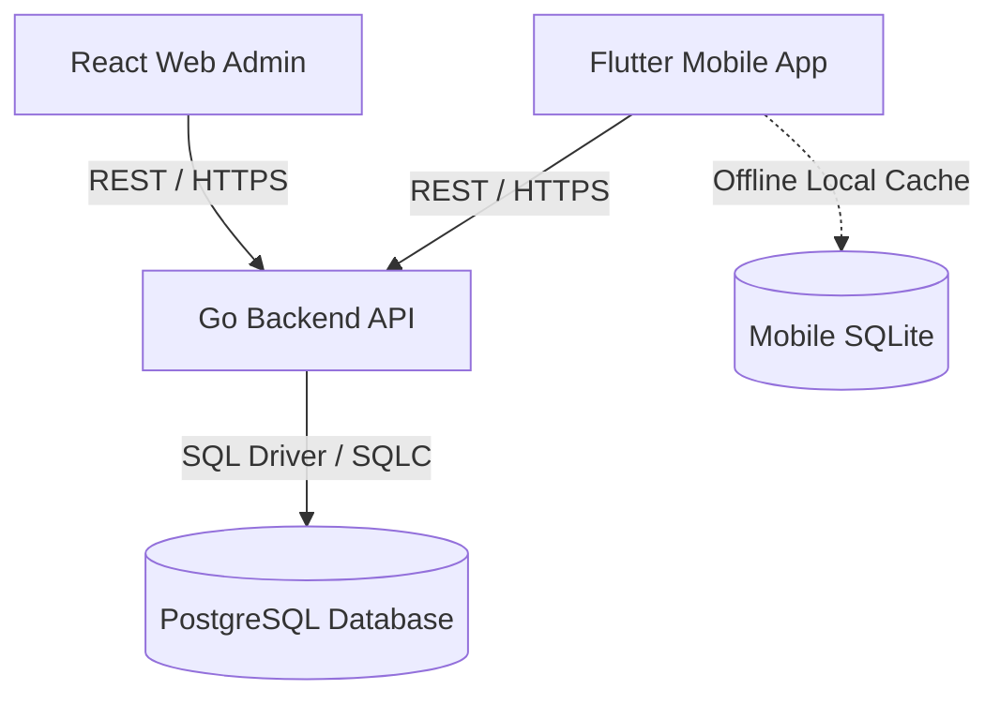

# Architecture Spine — Jemaat

## Design Paradigm

Modular Monolith with clean boundary interfaces:
- Go REST API backend (`apps/api`) organized into decoupled domain packages (`internal/membership`, `internal/serving`, `internal/caregroups`, `internal/portal`).
- React Admin web client (`apps/web`) organized by functional domains with shared UI components.
- Flutter mobile client (`apps/mobile`) implementing offline-first caching via local SQLite and background queue sync.



## Invariants & Rules

### AD-1 — Modular Monolith with Explicit Boundary Interfaces
- **Binds:** `all` (`membership`, `serving`, `caregroups`, `portal`, `api`)
- **Prevents:** Spaghetti cross-imports between domain packages and cross-table database mutations that bypass domain entity boundaries.
- **Rule:** Each backend domain package manages its own schema tables and domain logic. Cross-component operations must invoke the public service interface of the owning component; direct foreign key writes or cross-module database mutations are forbidden.

### AD-2 — Zero Copyleft Permissive Licensing (MIT)
- **Binds:** `all` (`api`, `web`, `mobile`, dependencies)
- **Prevents:** Legal encumbrance and loss of private/commercial forkability resulting from viral copyleft (GPL/AGPL) dependencies.
- **Rule:** All third-party libraries, frameworks, and packages across all containers must be permissively licensed (MIT, Apache 2.0, BSD-3-Clause, ISC). Code from copyleft repositories (including ChurchCRM in `.temp/`) must never be imported or pasted into the codebase.

### AD-3 — Masked Privacy by Default for Congregational Data
- **Binds:** `membership`, `portal`, `api`, `web`, `mobile`
- **Prevents:** Unauthorized exposure of member personal contact details (phone, email, residential address) to other church attendees or public visitors.
- **Rule:** All mobile endpoints returning person data must mask phone numbers, emails, and addresses unless the individual has explicitly granted opt-in directory visibility. Administrative desk access requires authenticated JWT credentials with explicit church office role authorization.

### AD-4 — Centralized Conflict Detection for Volunteer Rosters
- **Binds:** `serving`, `api`, `web`, `mobile`
- **Prevents:** Double-booking volunteers across concurrent services or scheduling volunteers on dates they have registered as blocked out.
- **Rule:** The scheduling engine must evaluate candidate assignments against overlapping service schedules and active `volunteer_availability` records prior to roster persistence. Any detected conflict requires explicit coordinator override with an audited reason code.

### AD-5 — Offline-First SQLite Synchronization for Care Group Attendance
- **Binds:** `caregroups`, `mobile`, `api`
- **Prevents:** Attendance data loss or UI freezes when care group leaders log attendance in locations with weak or non-existent cellular connectivity.
- **Rule:** The mobile client must persist attendance records immediately to local SQLite storage. When connectivity is restored, records are pushed to the backend API via idempotent upsert requests keyed by `(meeting_id, person_id)`.

### AD-6 — Unified 6-Digit Church Code and QR Deep-Linking for Onboarding
- **Binds:** `portal`, `mobile`, `api`, `web`
- **Prevents:** Fragile church search workflows or complex URL typing during physical church lobby onboarding.
- **Rule:** Every church profile generates a unique 6-digit alphanumeric church code and an identical canonical QR deep link (`jemaat://church?code=XXXXXX`). Both entry mechanisms must resolve to the same church profile payload.

## Consistency Conventions

| Concern | Convention |
|---|---|
| Identifiers | UUIDv7 for all database primary keys (timestamp-ordered, distributed-friendly). |
| Timestamp & Timezone | UTC ISO-8601 (`YYYY-MM-DDTHH:MM:SSZ`) stored in database and API payloads; formatted to local church timezone in UI. |
| API Envelopes | Standard JSON envelope `{ "data": T, "error": { "code": string, "message": string } }`. |
| Error Responses | Machine-readable error codes (e.g. `ERR_CONFLICT_SCHEDULE`, `ERR_UNAUTHORIZED`, `ERR_NOT_FOUND`). |
| Mobile Auth | JWT bearer token in Authorization header, stored securely in device Keychain / KeyStore. |

## Stack (Seed)

| Name | Version |
|---|---|
| Go | 1.22+ |
| Gin / Chi | 1.9+ |
| PostgreSQL | 16+ |
| SQLC / pgx | v2+ |
| React | 18+ |
| Vite | 5+ |
| TypeScript | 5+ |
| Tailwind CSS | 3.4+ |
| Flutter | 3.22+ |
| Dart | 3.4+ |
| SQLite (sqflite / drift) | Latest permissive |

## Structural Seed

```text
jemaat/
├── apps/
│   ├── api/                  # Go REST API backend
│   │   ├── cmd/server/       # Application entry point
│   │   ├── internal/         # Private domain packages
│   │   │   ├── membership/   # Membership & Household logic
│   │   │   ├── serving/      # Volunteer rosters & schedules
│   │   │   ├── caregroups/   # Small groups & attendance
│   │   │   └── portal/       # Congregational feed & guest intake
│   │   └── migrations/       # SQL schema migrations
│   ├── web/                  # React Admin web portal
│   │   ├── src/
│   │   │   ├── components/   # Shared UI components
│   │   │   ├── pages/        # People, Households, Roster, Settings
│   │   │   └── lib/          # API client and auth state
│   └── mobile/               # Flutter mobile application
│       ├── lib/
│       │   ├── screens/      # Home, Serving, CareGroups, Directory
│       │   ├── services/     # API sync and SQLite local store
│       │   └── models/       # Client entity models
```

## Capability → Architecture Map

| Capability / Area | Lives in | Governed by |
|---|---|---|
| CAP-1: Household & Member Identity | `membership` (`api`, `web`, `mobile`) | AD-1, AD-3 |
| CAP-2: Ministry Roster & Scheduling | `serving` (`api`, `web`, `mobile`) | AD-1, AD-4 |
| CAP-3: Care Group Operations & Attendance | `caregroups` (`api`, `web`, `mobile`) | AD-1, AD-5 |
| CAP-4: Congregational Portal & Directory | `portal` (`api`, `web`, `mobile`) | AD-1, AD-3, AD-6 |
| CAP-5: Workflow Automation & Guest Intake | `portal` (`api`, `web`, `mobile`) | AD-1, AD-6 |

## Deferred

- Multi-campus physical facilities room booking (deferred to v0.2.0; not in initial church-operations PRD).
- Online tithes, credit card donations, and payment gateway integration (deferred to dedicated financial extension).
