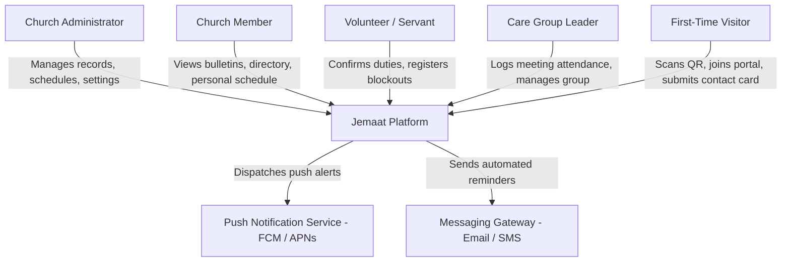

# C4 L1 — System Context: Jemaat

The system context diagram illustrates who interacts with Jemaat and the external boundary boundaries.

## Diagram

## Elements

| Element | What it is | Notes |
|---|---|---|
| **Church Administrator** | Primary back-office user managing member data, households, and settings | Accesses primarily via Web Admin |
| **Church Member** | Active congregant viewing service bulletins, sermons, and directory | Accesses via Mobile App |
| **Volunteer** | Church member scheduled for weekly ministry duties | Interacts via Mobile App 1-tap notifications |
| **Care Group Leader** | Small group coordinator tracking weekly meetings and pastoral care | Interacts via Mobile App (offline-capable) |
| **First-Time Visitor** | Newcomer discovering the church and submitting intake details | Interacts via QR code mobile scan |
| **Jemaat Platform** | Unified church administration and workflow platform | Subject of this architecture |
| **Push Notification Service** | Cloud notification delivery (Apple APNs / Google FCM) | Delivers instant volunteer and service alerts |
| **Messaging Gateway** | Transactional messaging service for welcome notes and OTPs | External communication channel |

## Relationships

| From | To | Purpose | Over |
|---|---|---|---|
| Church Administrator | Jemaat Platform | Manage households, rosters, groups, and tenant configuration | HTTPS / Web Admin |
| Church Member | Jemaat Platform | Access sermon bulletins, check personal schedule, browse directory | HTTPS / Mobile App |
| Volunteer | Jemaat Platform | Confirm, decline, or swap scheduled service roles | HTTPS / Mobile App |
| Care Group Leader | Jemaat Platform | Record attendance and submit meeting reports | HTTPS / SQLite Sync |
| First-Time Visitor | Jemaat Platform | Scan church QR code and submit newcomer intake card | HTTPS / Mobile App |
| Jemaat Platform | Push Notification Service | Dispatch serving duty notifications and meeting reminders | HTTPS / Provider API |
| Jemaat Platform | Messaging Gateway | Send onboarding OTPs and pastoral follow-up notices | HTTPS / REST API |

## What is deliberately not shown

- Internal software containers, database instances, and network load balancers (deferred to C4 L2).
- Financial payment gateways and donation processing (excluded from church-operations initiative).
