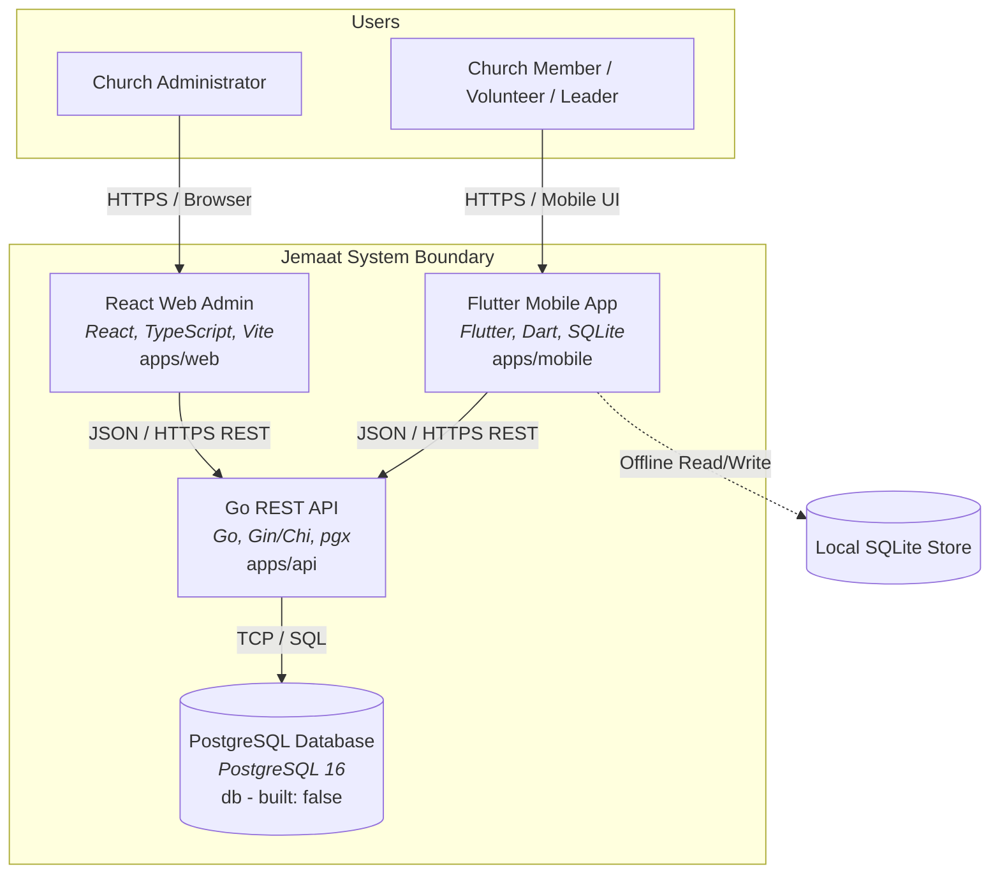

# C4 L2 — Containers: Jemaat

The container diagram illustrates the deployable units that make up Jemaat and how they communicate.

## Diagram

## Elements

| Element | What it is | Technology | Notes |
|---|---|---|---|
| **React Web Admin** (`web`) | Administrative single-page web portal | React 18, Vite, TypeScript, Tailwind CSS | Deployable web client (`built: true`) |
| **Flutter Mobile App** (`mobile`) | Congregational and leader mobile application | Flutter 3.x, Dart, SQLite | Multi-platform native client (`built: true`) |
| **Go REST API** (`api`) | Central backend application service | Go 1.22, Gin/Chi, SQLC, pgx | Backend business logic & migrations (`built: true`) |
| **PostgreSQL Database** (`db`) | Primary relational data store | PostgreSQL 16 | Relational database (`built: false`) |

## Relationships

| From | To | Purpose | Over |
|---|---|---|---|
| React Web Admin | Go REST API | Execute administrative queries, imports, and updates | HTTPS / REST |
| Flutter Mobile App | Go REST API | Sync schedules, submit RSVPs, push offline attendance | HTTPS / REST |
| Go REST API | PostgreSQL Database | Persist and query domain entities across all components | TCP / SQL |
| Flutter Mobile App | Local SQLite Store | Cache rosters and record meeting attendance offline | In-process SQLite |

## Product Components per container

Product Components per container — see `.control/registry/components.yaml`, each PC's `containers:`.

- `membership`: Lives in `api`, `web`, and `mobile`. Web administers master records and household merges; mobile provides self-service profile review; API validates uniqueness and updates records.
- `serving`: Lives in `api`, `web`, and `mobile`. Web displays the multi-department roster planning matrix; mobile allows volunteers 1-tap confirmation and blockout entry; API enforces scheduling conflict rules.
- `caregroups`: Lives in `api`, `web`, and `mobile`. Mobile provides offline check-in for small group leaders; web provides pastoral oversight of attendance health; API handles idempotent attendance synchronization.
- `portal`: Lives in `api`, `web`, and `mobile`. Mobile renders bulletins, QR onboarding, and directory; web manages announcements and visitor queue; API schedules notification alerts.

## What is deliberately not shown

- Internal software modules and packages inside the Go API (detailed in `c4-l3-api.md`).
- Infrastructure hosting topology, reverse proxies, and VPS configuration (managed in the devops repository).
