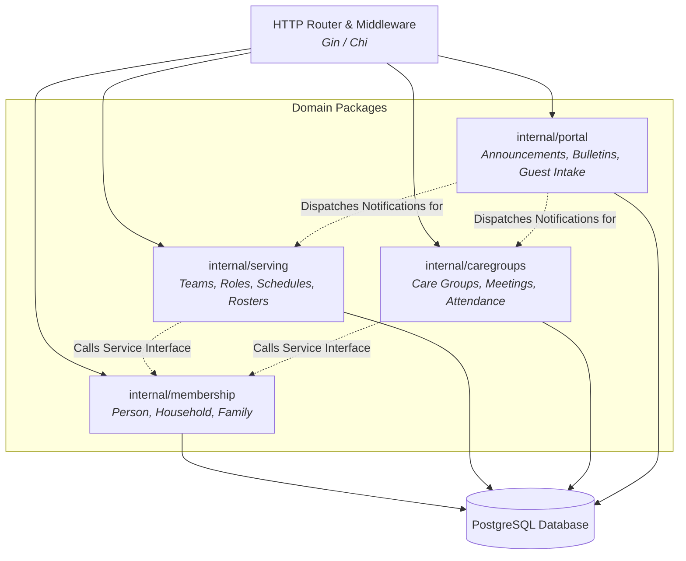

# C4 L3 — Components: Go REST API (`api`)

The L3 diagram illustrates the internal modular package structure within the Go backend API container.

## Diagram

## Elements

| Element | What it is | Notes |
|---|---|---|
| **HTTP Router & Middleware** | Request routing, JWT authentication, CORS, rate limiting, and request logging | Cross-cutting entry point |
| **`internal/membership`** | Domain logic for persons, households, family links, and member standing | Owns `person`, `household`, `family_relationship`, `membership_record` |
| **`internal/serving`** | Domain logic for ministry teams, roles, rosters, and conflict detection | Owns `ministry_team`, `serving_role`, `service_schedule`, `roster_assignment`, `volunteer_availability` |
| **`internal/caregroups`** | Domain logic for small groups, meeting sessions, and attendance sync | Owns `care_group`, `group_membership`, `meeting_session`, `attendance_record` |
| **`internal/portal`** | Domain logic for announcements, sermon bulletins, QR onboarding, and guest queue | Owns `church_profile`, `announcement`, `sermon_bulletin`, `guest_intake_entry`, `notification_event` |

## Relationships

| From | To | Purpose | Over |
|---|---|---|---|
| Router | Domain Packages | Dispatch authenticated HTTP requests to domain handlers | Go function calls |
| `internal/serving` | `internal/membership` | Verify member active standing before role assignment | Go service interface |
| `internal/caregroups` | `internal/membership` | Query person profiles for group roster enrollment | Go service interface |
| `internal/portal` | `internal/serving` | Trigger notifications for roster publication and volunteer reminders | In-process event bus |
| Domain Packages | PostgreSQL Database | Execute SQL queries and mutations generated via SQLC/pgx | Database connection pool |

## What is deliberately not shown

- Internal Go struct definitions, database migration files, and unit test suites.
