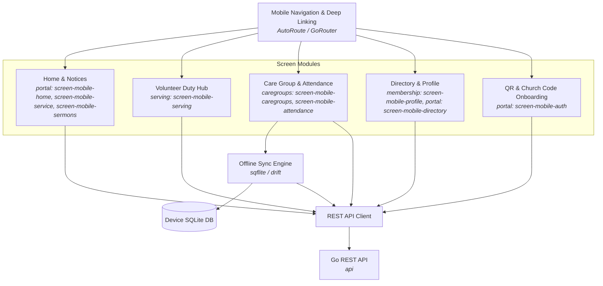

# C4 L3 — Components: Flutter Mobile Client (`mobile`)

The L3 diagram illustrates the client feature screens and offline caching architecture of the Flutter mobile app.

## Diagram

## Elements

| Element | What it is | Notes |
|---|---|---|
| **Mobile Navigation & Deep Linking** | Bottom navigation bar, stack navigation, and camera QR deep-link handling | App navigation core |
| **Home & Notices** | Sunday rundown, sermon notes, announcements, and quick duty pills | Realizes `screen-mobile-home`, `screen-mobile-service`, `screen-mobile-sermons` |
| **Volunteer Duty Hub** | Volunteer assignment cards with 1-tap Accept/Decline/Swap actions and blockouts | Realizes `screen-mobile-serving` |
| **Care Group & Attendance** | Group hub, meeting agenda, and local attendance check-in | Realizes `screen-mobile-caregroups`, `screen-mobile-attendance` |
| **Directory & Profile** | Searchable opt-in congregation directory and personal household profile | Realizes `screen-mobile-profile`, `screen-mobile-directory` |
| **QR & Church Code Onboarding** | Welcome splash, camera QR scanner, 6-digit code entry, and OTP login | Realizes `screen-mobile-auth` |
| **Offline Sync Engine** | Local SQLite storage and automatic background sync reconciliation | Realizes `AD-5`, `FR-17` |

## Relationships

| From | To | Purpose | Over |
|---|---|---|---|
| NavRouter | Screen Modules | Route mobile user or process deep link (`jemaat://church?code=...`) | Flutter Navigator |
| Care Group Check-In | Offline Sync Engine | Save attendance immediately to device storage | SQLite async write |
| Offline Sync Engine | Go REST API | Push batched attendance logs when connectivity is restored | HTTPS / REST |
| Screen Modules | REST API Client | Fetch live schedules, submit RSVPs, and query directories | HTTPS / REST |

## What is deliberately not shown

- Platform-specific native platform channels (iOS Keychain, Android Keystore, camera drivers).
