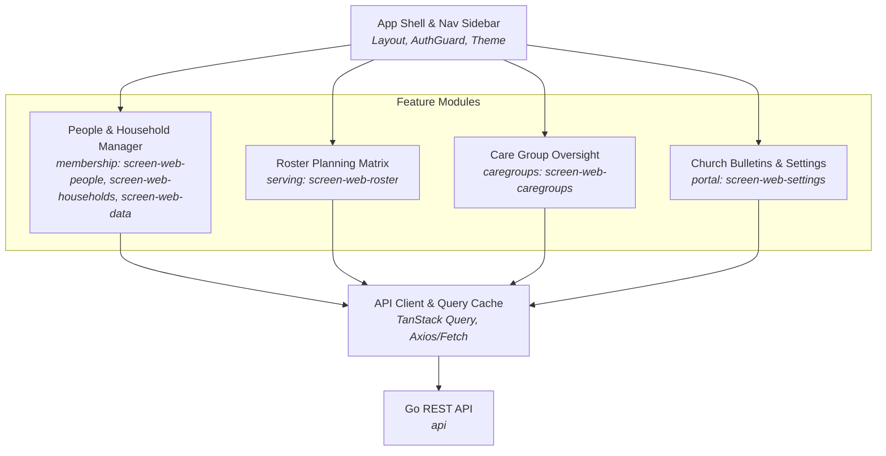

# C4 L3 — Components: React Web Admin (`web`)

The L3 diagram illustrates the modular page and component structure of the React administrative web portal.

## Diagram

## Elements

| Element | What it is | Notes |
|---|---|---|
| **App Shell & Nav Sidebar** | Common navigation layout, session authentication guard, and theme tokens | Core application scaffold |
| **People & Household Manager** | UI views for member profiles, household linking, and CSV import/merge | Realizes `screen-web-people`, `screen-web-households`, `screen-web-data` |
| **Roster Planning Matrix** | Interactive weekly calendar grid for volunteer scheduling and status tracking | Realizes `screen-web-roster` |
| **Care Group Oversight** | Administrative dashboard for care group zones, leaders, and attendance health | Realizes `screen-web-caregroups` |
| **Church Bulletins & Settings** | Church profile configuration, QR code printing, and announcements | Realizes `screen-web-settings` |
| **API Client & Query Cache** | Type-safe HTTP client with caching, error handling, and token interceptors | Shared API layer |

## Relationships

| From | To | Purpose | Over |
|---|---|---|---|
| App Shell | Feature Modules | Route user to requested administrative views | React Router |
| Feature Modules | API Client | Fetch and mutate church domain data | TypeScript function calls |
| API Client | Go REST API | Exchange JSON payloads | HTTPS / REST |

## What is deliberately not shown

- Individual React leaf components, form hook implementations, and styling CSS modules.
